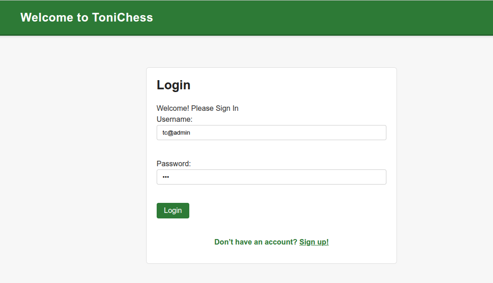
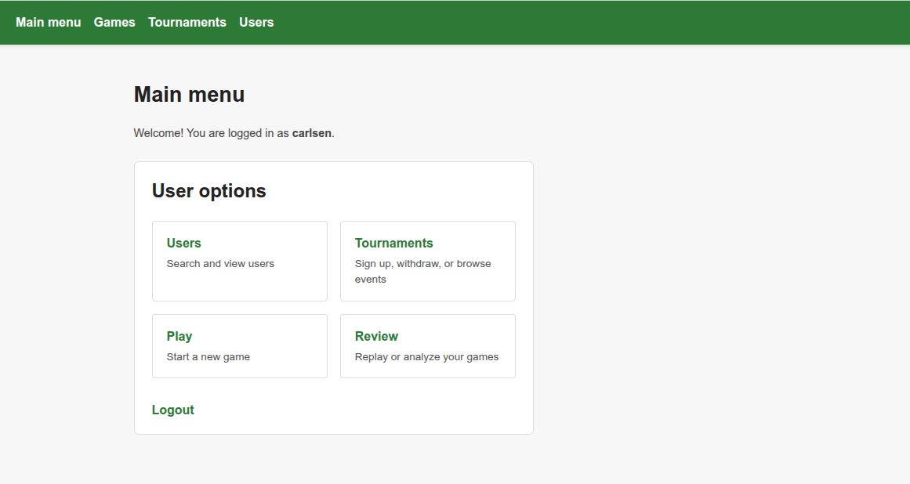
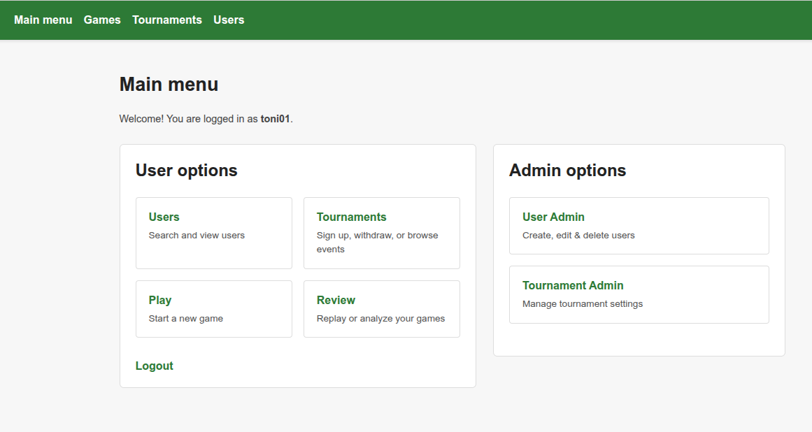
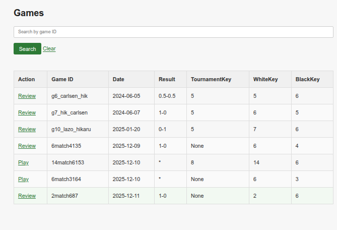
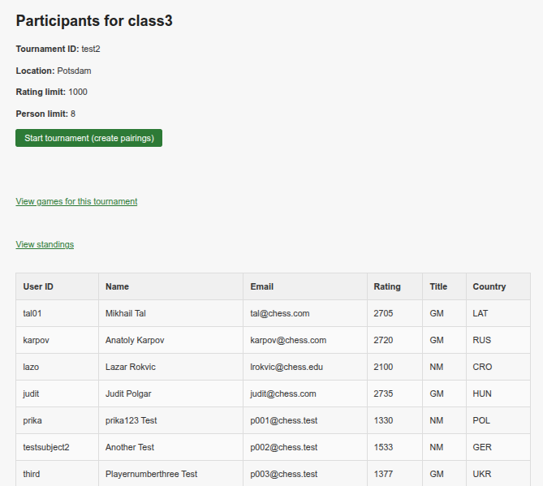
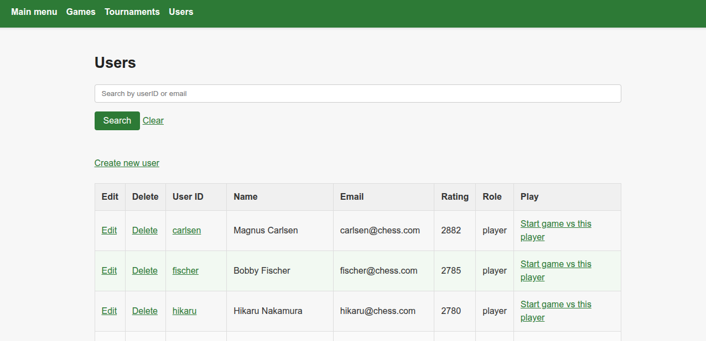

# ToniChess  
Created by **Toni Crnjak**

ToniChess is a Flask-based web application built to streamline chess club operations by providing a unified platform for managing users, organizing tournaments, and playing or reviewing games directly in the browser. The app stores data in MySQL and uses the [python-chess](https://python-chess.readthedocs.io/) library to validate moves and render games in SAN/ASCII form. Administrators can create and maintain player accounts, configure tournaments with custom rules, and oversee gameplay, while regular users can join events, record moves using SAN notation, and review complete game histories reconstructed through python-chess.

---

## ⭐ Preview of the Application

### **Login**


### **Main Menu (User View)**


### **Main Menu (Admin View)**


---

## Features

### **User Profile & Game History**


- View personal stats  
- Access completed and ongoing games  
- Review game histories through replay mode  

---

### **Game Browser**


- Search games  
- Review or continue games  
- Filter by tournament or user  

---

### **Tournament Participants & Pairings**


- View event details  
- Manage participants  
- Create pairings and start tournaments  

---

### **User Management (Admin)**


- Create users  
- Edit and delete accounts  
- Start games directly with selected users  

---

### **Database Schema**


ToniChess uses a clean relational schema across **users**, **tournaments**, **games**, **moves**, and **tournament entries**.

---

## Project Layout
- `app_flask.py` – Flask app with routes for authentication, tournaments, games, and review flows.  
- `baseObject.py` – Base CRUD helper that reads table names and credentials from `config.yml`.  
- `user.py`, `tournament.py`, `tournament_entry.py`, `game.py`, `move.py` – Data-layer classes for each entity.  
- `templates/` – Jinja templates for login, dashboards, tournaments, and game play/review screens.  
- `static/` – Shared CSS and assets.  
- `initializing.py` – Optional bootstrap script for creating MySQL tables and loading sample data.  

---

## Requirements
- Python 3.10+  
- MySQL 5.7+ or MariaDB  
- Required packages:  


Install the dependencies:

```bash
pip install flask flask-session pymysql pyyaml python-chess
```

## Configuration
Copy the example configuration to `config.yml` and fill in your MySQL credentials and table names:

```yaml
# config.yml

db:
  user: "your_username"
  pw: "your_password"
  host: "localhost"
  db: "tonichess"

tables:
  user: "chess_users"
  tournament: "chess_tournaments"
  game: "chess_games"
  move: "chess_moves"
  tournamentEntry: "tournamentEntry"
```

## Database setup (optional)
Run the bootstrap script after configuring the database to create the tables and load demo rows:

```bash
python initializing.py
```

The seed data includes an admin account (`toni01` / `123`) and several player accounts (e.g., `tal01` / `123`, `carlsen` / `123`).

## Running the app
Start the Flask development server:

```bash
python app_flask.py
```

Visit `http://127.0.0.1:5000` and log in with one of the seeded accounts, or create your own via the admin interface.

The website utilizes Analtical queries 
```sql
SELECT u.userID, u.email, COUNT(g.gameID) AS games_played
FROM chess_users u
LEFT JOIN chess_games g
  ON u.userID = g.whiteID OR u.userID = g.blackID
GROUP BY u.userID;```


## Development notes
- Session data is stored on the filesystem via `Flask-Session`.
- Game logic uses python-chess for move validation and board representation.
- Tournament helpers can automatically add tiebreak games and advance knockout rounds when results are available.

## Contributing
Issues and pull requests are welcome. If you add new database tables or configuration values, document them in `config_example.yml` so others can set up their environments easily.
